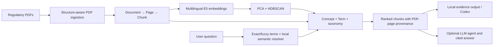

# Provenance-First Neo4j Graph RAG

This repository builds a reproducible knowledge graph and retrieval pipeline
for nine Hong Kong banking-regulation PDFs. The current implementation is
provenance-first: every retrieved statement remains traceable to its source
document, PDF page, and exact chunk text.

The core graph construction and local retrieval workflow does **not** require
an LLM API. OpenAI integration is optional and is used only for typed fact
extraction or final agentic answer generation.

## Current validated graph

The latest local build was validated with the following Neo4j snapshot:

| Item | Count |
| --- | ---: |
| Documents | 9 |
| PDF pages | 304 |
| Chunks | 1,192 |
| Non-TOC induction chunks | 1,161 |
| Concepts | 26 |
| Root / parent / leaf concepts | 1 / 5 / 20 |
| Normalized terms | 240 |
| Ontology runs | 1 |

Counts may change when source PDFs, chunking settings, or model versions
change. The ontology run stored in Neo4j records the corpus hash and settings.

## Architecture



### Provenance graph model

```text
(:Document)-[:HAS_PAGE]->(:Page)-[:HAS_CHUNK]->(:Chunk)
(:Page)-[:NEXT_PAGE]->(:Page)
(:Chunk)-[:NEXT]->(:Chunk)
(:OntologyRun)-[:USED_CHUNK]->(:Chunk)
(:OntologyRun)-[:GENERATED]->(:Concept)
(:Chunk)-[:ABOUT_CONCEPT {confidence, method}]->(:Concept)
(:Concept)-[:REPRESENTED_BY {rank, similarity}]->(:Chunk)
(:Chunk)-[:MENTIONS_TERM {match_scope, count}]->(:Term)
(:Term)-[:NORMALIZED_TO]->(:Concept)
(:Chunk)-[:SUPPORTS {quote, confidence, extractor}]->(:Fact)
(:Concept)-[:SUBJECT_OF]->(:Fact)-[:OBJECT_OF]->(:Concept)
```

`Document`, `Page`, and `Chunk` form the immutable evidence layer. Automatically
induced semantic nodes can be rebuilt without losing the original PDF-page
provenance.

## Method

1. **Regulatory-aware chunking** removes repeated headers and footers, detects
   contents pages, preserves numbered clauses, and splits oversized clauses at
   sentence or list boundaries. Exact source text and retrieval context are
   stored separately.
2. **Automatic concept induction** embeds non-TOC chunks with
   `intfloat/multilingual-e5-small`, reduces dimensions with PCA, discovers leaf
   topics with HDBSCAN, extracts bilingual terms with class-based TF-IDF, and
   creates parent topics with silhouette-selected agglomerative clustering.
3. **Question-to-concept resolution** first applies exact and fuzzy normalized
   term matching. If lexical evidence is insufficient, a local multilingual
   MiniLM MaxSim resolver compares the question with stored Concept and Term
   vectors. A lexical chunk fallback prevents ontology misses.
4. **Provenance-first relationships** store confidence, method, model, ontology
   run, representative chunks, and exact supporting quotes instead of creating
   untraceable concept-to-concept claims.
5. **Optional agentic generation** lets an API-backed agent choose graph,
   full-text, or approved-fact retrieval. It receives only evidence returned by
   tools and must cite the source PDF page.

See [`implement_code/README.md`](implement_code/README.md) for command details
and [`implement_code/RETRIEVAL_POLICY.md`](implement_code/RETRIEVAL_POLICY.md)
for resolver thresholds and ranking policy.

## Repository layout

| Path | Purpose |
| --- | --- |
| `implement_code/` | Current provenance-first Neo4j Graph RAG implementation |
| `dataset/datasets/` | Nine PDFs loaded by the current ingestion pipeline |

Downloaded models, Python environments, caches, Chroma/Neo4j runtime data, and
generated chunk-review files are intentionally excluded because they are large
or reproducible from the committed sources.

## Requirements

- Windows PowerShell commands are shown below.
- Conda with Python 3.10 or 3.11.
- Neo4j 5.x running locally with Bolt enabled.
- Internet access on the first concept-build/retrieval run to download local
  Hugging Face models.
- An OpenAI API key only for optional LLM modes.

## Setup

```powershell
git clone https://github.com/Jacky-wky/Graph-Rag.git
cd Graph-Rag
conda create -n rag python=3.11 -y
conda activate rag
python -m pip install -r implement_code/requirements.txt
Copy-Item implement_code/.env.example implement_code/.env
```

Edit `implement_code/.env` and set your local Neo4j password:

```dotenv
NEO4J_URI=bolt://localhost:7687
NEO4J_USER=neo4j
NEO4J_PASSWORD=change_me
NEO4J_DATABASE=neo4j
```

Do not commit `.env`. `OPENAI_API_KEY` and `HF_TOKEN` are optional.

## Build the graph

```powershell
conda activate rag
cd implement_code

# 1. Validate PDF parsing and chunking without writing to Neo4j.
python load_pdf_into_neo4j.py --dry-run

# 2. Rebuild Document, Page, and Chunk provenance nodes.
python load_pdf_into_neo4j.py --reset

# 3. Preview automatic Concept, Term, and taxonomy construction.
python improve_relationships.py --dry-run

# 4. Replace the old semantic layer with the new ontology run.
python improve_relationships.py --clear-old
```

The loader reads `../dataset/datasets` automatically. The first ontology build
downloads local embedding models and caches chunk embeddings under
`implement_code/.cache/concept_induction`.

## Audit chunks

Export one Markdown file per chunk without modifying Neo4j:

```powershell
python export_chunks_to_markdown.py --overwrite
```

Open `implement_code/chunk_review/_index.md`. Each file shows the source PDF,
page, section path, chunk metadata, exact text, and retrieval text.

## Retrieve without an LLM API

```powershell
python local_graph_rag.py "customer due diligence 有哪些控制要求？"
```

This command resolves the question locally, retrieves graph-connected chunks,
and prints PDF-page evidence. The evidence can be reviewed directly or supplied
to Codex for answer synthesis without calling an external LLM API from this
repository.

## Optional fact extraction and agent

The local rules mode creates evidence-backed candidate facts without an API:

```powershell
python extract_provenance_facts.py --mode rules --limit 20
python review_provenance_facts.py list
```

Only use the following after setting `OPENAI_API_KEY` locally:

```powershell
python extract_provenance_facts.py --mode llm --limit 20
python agentic_rag.py "What controls are required for customer due diligence?"
```

## Inspect Neo4j

Open Neo4j Browser and run:

```cypher
MATCH (document:Document)-[:HAS_PAGE]->(page:Page)-[:HAS_CHUNK]->(chunk:Chunk)
RETURN document, page, chunk
LIMIT 100;
```

```cypher
MATCH (chunk:Chunk)-[relationship]->(concept:Concept)
RETURN chunk, relationship, concept
LIMIT 100;
```

```cypher
MATCH (term:Term)-[:NORMALIZED_TO]->(concept:Concept)
RETURN term, concept
LIMIT 200;
```

```cypher
MATCH (run:OntologyRun)
RETURN run
ORDER BY run.created_at DESC
LIMIT 1;
```

## Security and reproducibility

- Real `.env` files, credentials, downloaded models, virtual environments, and
  generated databases are ignored by Git.
- Hugging Face libraries can read the optional `HF_TOKEN` from the environment;
  credentials are never embedded in source files.
- Only the current implementation, its methodology, and the nine source PDFs
  are committed so the graph can be rebuilt from source.
- Before redistributing a fork, verify the applicable terms for the included
  regulatory PDFs and third-party model artifacts.
